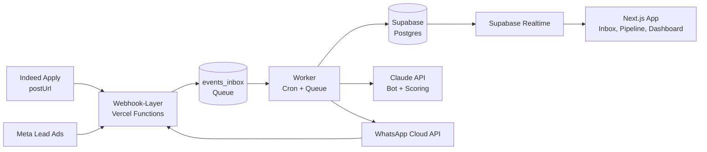
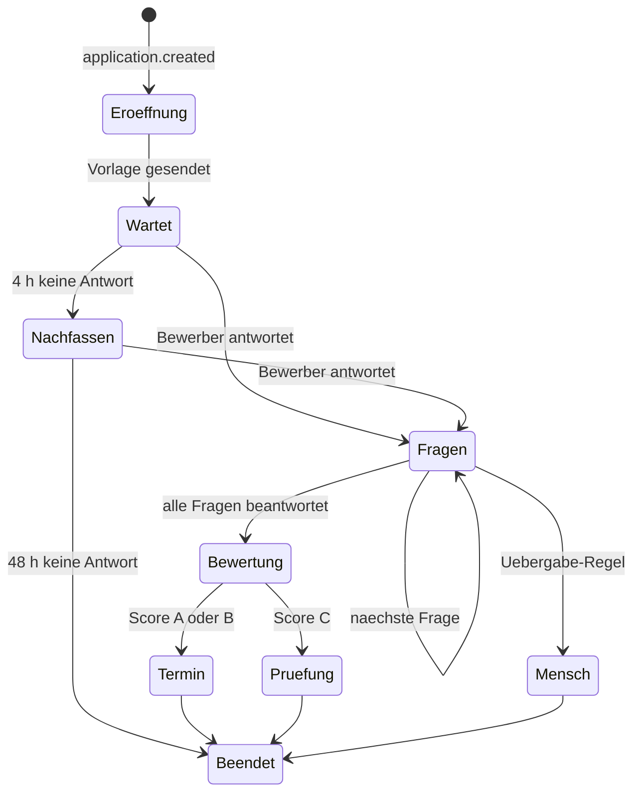

# Spec: Recruiting-Plattform mit WhatsApp-KI-Bot, Inbox und Indeed-Anbindung

Stand: 20.09.2026 · Version 1.0

## Hinweise für die Umsetzung

- Dieses Dokument ist die verbindliche Vorgabe. Bei Unklarheit: die einfachste Lösung wählen, die die Abnahmekriterien in Abschnitt 16 erfüllt, und die Annahme im Code kommentieren.
- Sprache im UI: Deutsch. Code, Tabellen- und Feldnamen: Englisch.
- Reihenfolge der Umsetzung: strikt nach den Bauphasen in Abschnitt 16.
- Jede Phase endet mit lauffähigem Stand, Migrationen, Seed-Daten und Tests.

---

## 1. Überblick und Ziele

Gebaut wird eine mandantenfähige Recruiting-Plattform, die Bewerbungen aus Indeed und Meta-Ads automatisch einsammelt, per WhatsApp-KI-Bot vorqualifiziert und den Kunden in Inbox, Pipeline und Dashboard bereitstellt. Betreiber ist die Agentur, Nutzer sind ihre Kundenunternehmen.

**Kernversprechen an den Kunden:** Nummer verbinden, Job anlegen, fertig. Jede Bewerbung wird innerhalb von 60 Sekunden per WhatsApp kontaktiert, vorqualifiziert, bewertet und bei Eignung zum Termin geführt.

**Im Umfang (v1)**

- Bewerbereingang aus Indeed (Indeed Apply per postUrl) und Meta Lead Ads, plus manueller Import und öffentliches Bewerbungsformular
- WhatsApp-Anbindung pro Kunde über Embedded Signup mit eigener Nummer
- KI-Vorqualifizierungsbot mit fester Fragenliste pro Job, Scoring und Übergabe an Menschen
- Chat-Inbox mit Echtzeit-Nachrichten, Bot-Status, Übernahme und Vorlagenversand
- Jobs, Pipeline (Kanban), Bewerberprofil mit Verlauf
- Terminbuchung, Terminerinnerungen und eine regelbasierte Automations-Engine
- Kunden-Dashboard und Agentur-Dashboard über alle Kunden
- DSGVO-Funktionen: Einwilligung, Löschfristen, Auskunft, Audit-Log

**Nicht im Umfang (v1)**

- Multiposting auf weitere Jobbörsen, Karriereseiten-Baukasten
- Automatische Absagen durch die KI (Entscheidung trifft immer ein Mensch)
- Native Mobile-App (Web-App ist mobil nutzbar)
- Abrechnung/Billing im Produkt (läuft vorerst außerhalb)

**Erfolgskriterien**

| Kennzahl | Zielwert |
| --- | --- |
| Zeit von Bewerbung bis erster WhatsApp-Nachricht | unter 60 Sekunden |
| Antwortquote auf Erstnachricht | über 60 % |
| Abschlussquote der Vorqualifizierung bei Antwortenden | über 75 % |
| Onboarding eines neuen Kunden bis zum ersten Live-Job | unter 60 Minuten |
| Verlorene Bewerbungen | 0 (jede Zustellung wird persistiert oder erneut versucht) |

---

## 2. Rollen und Mandantenmodell

Jeder Kunde ist ein eigener Mandant (`organization`); alle Daten tragen eine `org_id` und sind per Row Level Security strikt getrennt. Die Agentur steht als Plattformbetreiber über allen Mandanten.

| Rolle | Ebene | Darf |
| --- | --- | --- |
| Platform Admin | Agentur | Alle Mandanten sehen und verwalten, Vorlagen-Sets und Bot-Presets pflegen, Agentur-Dashboard, Impersonation mit Audit-Eintrag |
| Org Admin | Kunde | Nutzer einladen, WhatsApp-Nummer verbinden, Jobs, Automationen, Einstellungen, alle Bewerber |
| Recruiter | Kunde | Bewerber, Inbox, Pipeline, Termine; keine Einstellungen |
| Viewer | Kunde | Nur lesen: Dashboard, Bewerber, Chats |

**Regeln**

- Ein Nutzer kann mehreren Mandanten angehören (`memberships`), mit Rolle je Mandant und Mandantenumschalter im UI.
- Recruiter können optional auf einzelne Jobs beschränkt werden (`job_assignments`).
- Login per E-Mail-Magic-Link und Passwort; 2FA (TOTP) optional pro Nutzer, für Platform Admins Pflicht.
- Impersonation durch Platform Admin schreibt immer einen Eintrag ins Audit-Log und zeigt ein sichtbares Banner.
- Ein Mandant hat genau eine aktive WhatsApp-Nummer in v1; das Datenmodell erlaubt mehrere.

---

## 3. Systemarchitektur und Tech-Stack

Die Plattform ist eine Next.js-App auf Vercel mit Supabase als Datenbank, Auth, Realtime und Storage. Alle eingehenden Ereignisse landen zuerst in einer Queue-Tabelle und werden asynchron verarbeitet, damit kein Webhook verloren geht.



Webhooks schreiben nur in die Queue und antworten sofort mit 200; Worker verarbeiten, rufen die KI auf und senden über WhatsApp; das UI bekommt Änderungen per Realtime.

| Baustein | Technologie | Aufgabe |
| --- | --- | --- |
| Frontend + API | Next.js (App Router), TypeScript, Tailwind, shadcn/ui | UI, Server Actions, Route Handler für Webhooks |
| Hosting | Vercel (Region Frankfurt `fra1`) | App, Functions, Cron |
| Datenbank | Supabase Postgres (EU-Region) mit RLS | Alle Daten, Mandantentrennung |
| Auth | Supabase Auth | Login, Sessions, 2FA |
| Realtime | Supabase Realtime | Live-Inbox, Pipeline-Updates |
| Dateien | Supabase Storage (private Buckets) | Lebensläufe, Medien aus Chats |
| Queue | Tabelle `events_inbox` + `pgmq` oder Vercel Queues | Zuverlässige asynchrone Verarbeitung |
| Scheduler | Vercel Cron (jede Minute) + `scheduled_jobs` | Reminder, Nachfassen, Löschfristen |
| KI | Claude API: `claude-haiku-4-5` für Dialog, `claude-sonnet-5` für Abschlussbewertung | Bot, Extraktion, Scoring |
| WhatsApp | WhatsApp Cloud API über Embedded Signup (direkt als Tech Provider oder über 360dialog/Twilio) | Senden, Empfangen, Vorlagen |
| Termine | Eigene Slot-Logik in v1; Calendly/Google Calendar als Option | Buchung und Erinnerung |
| Monitoring | Sentry, Vercel Logs, Healthcheck-Endpoint | Fehler, Alarme |

**Architekturregeln**

- Jeder Webhook ist idempotent: eindeutiger Schlüssel aus Quelle + externer ID, Duplikate werden verworfen.
- Secrets und WhatsApp-Tokens liegen verschlüsselt in der Datenbank (Supabase Vault oder pgcrypto), nie im Frontend.
- Alle Zugriffe aus dem Browser laufen über RLS; nur Worker nutzen den Service-Role-Key.
- Der WhatsApp-Zugang ist hinter einem Interface `WhatsAppProvider` gekapselt, damit Direktanbindung und BSP austauschbar sind.
- Der KI-Zugang ist hinter einem Interface `LlmClient` gekapselt; Modellnamen stehen in der Konfiguration, nicht im Code.

---

## 4. Datenmodell (Supabase)

Alle fachlichen Tabellen tragen `id uuid`, `org_id uuid`, `created_at`, `updated_at`; RLS erlaubt Zugriff nur bei passender Mitgliedschaft. Telefonnummern werden immer im E.164-Format gespeichert.

| Tabelle | Zweck | Wichtigste Felder |
| --- | --- | --- |
| `organizations` | Mandant | name, slug, timezone, retention_days (Standard 180), settings jsonb, status |
| `profiles` | Nutzerprofil zu auth.users | full_name, avatar_url, is_platform_admin |
| `memberships` | Nutzer-Mandant-Rolle | user_id, org_id, role (org_admin, recruiter, viewer) |
| `job_assignments` | Recruiter auf Jobs beschränken | user_id, job_id |
| `whatsapp_accounts` | Verbundene Nummer | waba_id, phone_number_id, display_number, access_token_enc, provider, quality_rating, messaging_limit, status, connected_at |
| `whatsapp_templates` | Vorlagen je Mandant | wa_account_id, name, language, category, body, variables jsonb, meta_template_id, status (pending, approved, rejected, paused), preset_key |
| `jobs` | Stelle | title, description, location, employment_type, status (draft, active, paused, closed), external_ref, indeed_enabled, indeed_mode (apply, redirect, off), apply_url, bot_config_id |
| `pipeline_stages` | Pipeline-Stufen je Mandant | name, position, type (new, qualifying, qualified, interview, offer, hired, rejected) |
| `candidates` | Person | first_name, last_name, phone_e164, email, city, consent_whatsapp, consent_at, consent_source, language, deleted_at |
| `applications` | Bewerbung einer Person auf einen Job | candidate_id, job_id, stage_id, source (indeed, meta, form, manual), source_ref, campaign jsonb, status, score, score_label (A, B, C), score_reasons jsonb, summary, assigned_to, applied_at |
| `application_answers` | Antworten aus Indeed-Screening und Bot | application_id, question_key, question_text, answer_raw, answer_normalized jsonb, origin (indeed, bot, form) |
| `documents` | Lebenslauf, Anhänge | application_id, storage_path, mime, size, origin |
| `bot_configs` | Bot-Einstellung je Job | persona, tone, formality (du, sie), language, intro_text, faq jsonb, max_turns, handover_rules jsonb, scoring_rules jsonb, active |
| `bot_questions` | Fragenliste je Bot-Config | position, key, text, type (text, number, choice, yes_no, date), options jsonb, required, knockout_rule jsonb, weight |
| `conversations` | Chat je Bewerber und Nummer | candidate_id, wa_account_id, application_id, state (bot_active, human_active, waiting, closed), bot_step, window_expires_at, unread_count, last_message_at, assigned_to |
| `messages` | Einzelne Nachricht | conversation_id, direction (in, out), sender_type (candidate, bot, user, system), user_id, type (text, template, image, document, audio, interactive), body, media_path, wa_message_id, status (queued, sent, delivered, read, failed), error_code, template_id, cost_category |
| `appointments` | Termin | application_id, starts_at, ends_at, type (call, video, onsite), location, status (proposed, booked, confirmed, no_show, done, cancelled), booked_via, booking_token |
| `availability_rules` | Buchbare Slots | user_id oder job_id, weekday, start, end, slot_minutes, buffer_minutes |
| `automations` | Regel | name, trigger_type, trigger_config jsonb, conditions jsonb, actions jsonb, active |
| `automation_runs` | Ausführungsprotokoll | automation_id, application_id, status, log jsonb |
| `scheduled_jobs` | Geplante Aktionen | run_at, type, payload jsonb, status, attempts, dedupe_key |
| `events_inbox` | Roh-Webhooks als Queue | source, external_id, payload jsonb, status, attempts, error, received_at |
| `lead_sources` | Meta-Formulare und Indeed-Feeds | type, external_id, job_id, mapping jsonb, secret |
| `quick_replies` | Textbausteine der Inbox | title, body, shortcut |
| `notes` | Interne Notizen | application_id, user_id, body |
| `activity_log` | Verlauf am Bewerber | application_id, actor_type, actor_id, action, data jsonb |
| `audit_log` | Sicherheitsrelevantes | actor_id, org_id, action, target, ip, data jsonb |
| `ai_calls` | Protokoll der KI-Aufrufe | conversation_id, purpose, model, prompt_version, input_tokens, output_tokens, latency_ms, ok, error |
| `usage_daily` | Verbrauch je Mandant und Tag | messages_out, templates_by_category jsonb, ai_input_tokens, ai_output_tokens, ai_cost_usd |

**Constraints und Indizes**

- `candidates`: eindeutig auf (`org_id`, `phone_e164`); Dubletten werden beim Eingang zusammengeführt.
- `applications`: eindeutig auf (`org_id`, `source`, `source_ref`) für Idempotenz.
- `messages`: eindeutig auf `wa_message_id`; Index auf (`conversation_id`, `created_at`).
- `conversations`: eindeutig auf (`wa_account_id`, `candidate_id`); Index auf (`org_id`, `last_message_at desc`).
- `scheduled_jobs`: Index auf (`status`, `run_at`); eindeutig auf `dedupe_key`.
- Soft-Delete nur bei `candidates`; die Löschroutine anonymisiert und entfernt Dateien endgültig.

**RLS-Grundmuster**

- Hilfsfunktion `is_member(org_id)` und `has_role(org_id, roles[])` als `security definer`.
- `select`: Mitglied des Mandanten. `insert/update/delete`: je Tabelle mindestens Recruiter, Einstellungen nur Org Admin.
- Platform Admins erhalten Lesezugriff über `profiles.is_platform_admin`; Schreiben nur über Impersonation.
- Für jede Tabelle existiert ein automatisierter Test, der Fremdzugriff zwischen zwei Test-Mandanten ausschließt.

---

## 5. Indeed-Integration

Ziel ist Indeed Apply über einen XML-Feed mit `postUrl`, sodass Indeed jede Bewerbung direkt an die Plattform sendet. Bis zur Freigabe durch Indeed läuft ein Übergangsmodus mit Weiterleitung auf das eigene Bewerbungsformular. Grundlage: [Indeed Partner Docs zu Indeed Apply](https://docs.indeed.com/indeed-apply/) und der [Integrationspfad für Agenturen und Drittplattformen](https://docs.indeed.com/indeed-apply/agencies-and-third-party-platforms).

**Modus A: Indeed Apply (Zielzustand)**

1. Pro Mandant wird ein XML-Feed unter `/api/feeds/indeed/{org_slug}.xml?key={secret}` erzeugt; er enthält alle Jobs mit `status = active` und `indeed_mode = apply`.
2. Jeder `<job>` enthält ein `<indeed-apply-data>`-Element mit `postUrl`, `jobId`, Firmenname und der URL der Screening-Fragen.
3. Screening-Fragen liegen als JSON unter `/api/indeed/questions/{job_id}.json`. Pflichtfragen: Telefonnummer und Einwilligung zur Kontaktaufnahme per WhatsApp (Ja/Nein).
4. Indeed sendet die Bewerbung als JSON-POST an `/api/webhooks/indeed/apply`. Der Handler prüft die Signatur im Header, schreibt den Rohpayload in `events_inbox` und antwortet mit 200.
5. Der Worker legt `candidate`, `application`, `application_answers` und den Lebenslauf in `documents` an und löst den Trigger `application.created` aus.

**Anforderungen an den postUrl-Endpunkt**

- Antwortzeit unter 2 Sekunden, Verarbeitung immer asynchron.
- Signaturprüfung mit dem Shared Secret; ungültige Signatur ergibt 401 und einen Eintrag im Audit-Log.
- Idempotenz über die Indeed-Bewerbungs-ID in `applications.source_ref`.
- Korrekte HTTP-Statuscodes laut Indeed-Referenz; bei internem Fehler 5xx, damit Indeed erneut zustellt.
- Monitoring: Alarm, wenn in 24 Stunden Feed-Abrufe stattfinden, aber keine Bewerbung ankommt, oder wenn die Fehlerquote über 1 % liegt. Indeed überwacht die Zustellung selbst und kann Indeed Apply bei Problemen deaktivieren.

**Modus B: Weiterleitung (Übergang)**

- Der Feed enthält die Jobs ohne Indeed-Apply-Daten; die Bewerben-URL zeigt auf `/apply/{org_slug}/{job_slug}?src=indeed`.
- Das öffentliche Formular fragt Name, Telefon, E-Mail, optional Lebenslauf und die WhatsApp-Einwilligung ab und erzeugt dieselben Datensätze wie Modus A.
- Der Modus ist pro Job umschaltbar (`jobs.indeed_mode`: apply, redirect, off).

**Freigabeprozess bei Indeed (außerhalb des Codes)**

- Partner-Anfrage stellen, Feed-URL einreichen, Testbewerbungen mit den Indeed-Testtools durchführen, Dokumentation mit Screenshots liefern.
- Erst nach Freigabe wird Modus A für Kundenjobs aktiviert.

**Datenmapping**

| Indeed-Feld | Ziel |
| --- | --- |
| Bewerbername | `candidates.first_name`, `last_name` |
| Telefon | `candidates.phone_e164` (normalisiert, Standardland DE) |
| E-Mail (ggf. Relay-Adresse) | `candidates.email` |
| Lebenslauf (Base64-Datei) | `documents` + Storage |
| Antworten auf Screening-Fragen | `application_answers` mit `origin = indeed` |
| WhatsApp-Einwilligung | `candidates.consent_whatsapp`, `consent_at`, `consent_source = indeed` |
| Job-ID | `applications.job_id` über `jobs.external_ref` |

Fehlt die Telefonnummer oder die Einwilligung, startet kein Bot; der Bewerber landet in der Stufe "Neu" mit dem Hinweis "Kein WhatsApp-Opt-in" und erhält stattdessen eine E-Mail mit Link zum Formular.

---

## 6. Meta-Leads und weitere Quellen

Alle Quellen münden in dieselbe Eingangsfunktion `ingestApplication()`, die Dubletten prüft, Datensätze anlegt und `application.created` auslöst. So verhält sich der Bot für jede Quelle gleich.

| Quelle | Anbindung | Besonderheit |
| --- | --- | --- |
| Meta Lead Ads | Webhook `leadgen` an `/api/webhooks/meta/leads`, danach Abruf der Lead-Daten über die Graph API mit dem Seiten-Token des Kunden | Zuordnung Formular zu Job über `lead_sources.mapping`; Einwilligung als Pflicht-Checkbox im Lead-Formular |
| Perspective-Funnel / externe Formulare | Generischer Webhook `/api/webhooks/generic/{source_id}` mit Secret im Header | Feldzuordnung pro Quelle im UI konfigurierbar |
| Öffentliches Bewerbungsformular | `/apply/{org_slug}/{job_slug}` | UTM-Parameter werden als Quelle gespeichert |
| Click-to-WhatsApp | Bewerber schreibt die Kundennummer direkt an, optional mit Job-Code im vorbefüllten Text | Servicefenster ist sofort offen, keine Vorlage nötig |
| Manuell / CSV-Import | UI | Opt-in muss beim Import bestätigt werden, sonst kein Bot-Start |

**Regeln für den Eingang**

- Dublette = gleiche `phone_e164` im Mandanten. Neue Bewerbung auf anderen Job erzeugt eine zweite `application` am selben `candidate`.
- Bewirbt sich dieselbe Person binnen 30 Tagen erneut auf denselben Job, wird keine neue Bewerbung angelegt, sondern ein Verlaufseintrag.
- Jede Bewerbung speichert `source`, `source_ref` und Kampagnendaten (Anzeige, Anzeigengruppe, UTM) für das Reporting.
- Ungültige Telefonnummern werden markiert; der Bot startet nicht, der Recruiter sieht einen Hinweis.

---

## 7. WhatsApp-Anbindung

Jeder Kunde verbindet seine eigene Nummer per Embedded Signup; die Plattform sendet und empfängt danach in seinem Namen über die WhatsApp Cloud API. Es wird direkt auf der aktuellen Embedded-Signup-Version gebaut, da [v2 am 8. Oktober 2026 abgeschaltet wird](https://developers.facebook.com/documentation/business-messaging/whatsapp/embedded-signup/onboarding-business-app-users).

**Onboarding-Ablauf im Kundenportal**

1. Org Admin klickt "WhatsApp verbinden"; das Meta-Popup öffnet sich (Facebook-Login ist bei EU-Nummern Pflicht).
2. Kunde wählt oder erstellt sein WhatsApp-Business-Konto und die Nummer. Option "bestehende WhatsApp-Business-App-Nummer verbinden" (Coexistence) wird angeboten, sofern für das Land verfügbar.
3. Die Plattform tauscht den Code gegen ein Token, speichert `waba_id`, `phone_number_id` und das verschlüsselte Token, abonniert die Webhooks und registriert die Nummer.
4. Das Standard-Vorlagenset wird automatisch im Kundenkonto angelegt und zur Prüfung eingereicht.
5. Statusseite zeigt: Nummer verbunden, Anzeigename, Qualitätsbewertung, Nachrichtenlimit, Vorlagenstatus. Erst wenn die Eröffnungsvorlage freigegeben ist, kann der Bot aktiviert werden.

**Nachrichtenregeln**

- Außerhalb des 24-Stunden-Servicefensters dürfen nur freigegebene Vorlagen gesendet werden; innerhalb sind freie Nachrichten erlaubt. `conversations.window_expires_at` wird bei jeder eingehenden Nachricht auf +24 h gesetzt.
- Vor jedem Versand prüft der Sender: Opt-in vorhanden, Fenster offen oder Vorlage gewählt, Nummer nicht gesperrt, Ruhezeiten eingehalten (Standard 08:00 bis 20:00 Uhr Ortszeit, Mo bis Sa; konfigurierbar).
- Ruhezeiten gelten nur für von der Plattform begonnene Nachrichten (Vorlagen, Reminder). Antworten auf eine gerade eingegangene Bewerbernachricht gehen immer sofort raus.
- STOP, Stopp, Abmelden oder Ähnliches setzt `consent_whatsapp = false`, beendet den Bot und bestätigt die Abmeldung einmalig.
- Statusmeldungen (sent, delivered, read, failed) aktualisieren `messages.status`; fehlgeschlagene Vorlagen werden mit Fehlercode angezeigt und nicht blind wiederholt.
- Eingehende Medien werden heruntergeladen und in den privaten Storage gelegt; Sprachnachrichten werden in v1 nur gespeichert, der Bot bittet um Text.

**Standard-Vorlagenset (wird je Mandant ausgerollt, Sprache de)**

| Preset-Key | Kategorie (Ziel) | Zweck | Variablen |
| --- | --- | --- | --- |
| `application_received` | Utility | Eröffnung nach Bewerbung, mit Button "Los geht's" | Vorname, Jobtitel, Firmenname |
| `qualification_nudge` | Utility | Nachfassen, wenn keine Antwort nach 4 Stunden | Vorname, Jobtitel |
| `qualification_resume` | Utility | Abgebrochenes Gespräch fortsetzen nach Fensterablauf | Vorname |
| `appointment_invite` | Utility | Einladung zur Terminbuchung mit Link | Vorname, Jobtitel, Buchungslink |
| `appointment_confirmation` | Utility | Bestätigung | Vorname, Datum, Uhrzeit, Ort oder Link |
| `appointment_reminder_24h` | Utility | Erinnerung am Vortag mit Buttons "Ich komme" / "Verschieben" | Vorname, Datum, Uhrzeit |
| `appointment_reminder_2h` | Utility | Erinnerung kurz vorher | Vorname, Uhrzeit, Ort oder Link |
| `no_show_followup` | Utility | Nach verpasstem Termin neuen Termin anbieten | Vorname, Buchungslink |
| `documents_request` | Utility | Fehlende Unterlagen anfordern | Vorname, Unterlage |
| `status_update` | Utility | Neutrale Statusinfo | Vorname, Jobtitel, Freitext |

Beispieltext `application_received`: "Hallo {{1}}, danke für deine Bewerbung als {{2}} bei {{3}}. Damit wir dich schnell einordnen können, haben wir 3 bis 5 kurze Fragen an dich. Das dauert etwa 2 Minuten." Button: "Los geht's".

Texte werden strikt als Reaktion auf die Bewerbung formuliert, ohne Werbesprache, damit Meta sie als Utility einstuft. Stuft Meta eine Vorlage als Marketing ein, zeigt die Plattform das an und warnt vor höheren Kosten.

**Vorlagenverwaltung**

- Platform Admin pflegt die Presets zentral; Änderungen erzeugen neue Versionen und werden pro Mandant neu eingereicht.
- Org Admin kann eigene Vorlagen anlegen (Name, Kategorie, Text, Variablen, Buttons) und den Prüfstatus sehen.
- Webhook `message_template_status_update` aktualisiert den Status; pausierte oder abgelehnte Vorlagen deaktivieren die betroffenen Automationen mit Hinweis.

**Bot-Richtlinie von Meta:** Erlaubt sind nur aufgabenspezifische KI-Agenten, keine allgemeinen Chatbots. Der Bot bleibt daher strikt beim Thema Bewerbung (siehe Abschnitt 8).

---

## 8. KI-Vorqualifizierungsbot

Der Bot führt jeden Bewerber per WhatsApp durch eine feste Fragenliste des Jobs, versteht freie Antworten, fragt bei Unklarheit nach und liefert am Ende Score, Begründung und Zusammenfassung. Der Ablauf ist eine Zustandsmaschine im Code; die KI formuliert und interpretiert, steuert aber nie selbst den Prozess.



Bei Score A oder B folgt automatisch die Termineinladung; Score C geht ohne Absage in die manuelle Prüfung.

**Ablauf im Detail**

1. Trigger `application.created` mit Opt-in: Eröffnungsvorlage `application_received` wird gesendet, `conversations.state = bot_active`, `bot_step = 0`.
2. Antworten aus dem Indeed-Screening werden vorab übernommen; bereits beantwortete Fragen überspringt der Bot.
3. Pro eingehender Nachricht läuft ein KI-Aufruf mit: Systemprompt, Job-Kontext, Fragenliste mit Status, bisheriger Verlauf, aktuelle Frage. Die KI gibt strukturiertes JSON zurück (siehe unten).
4. Der Code validiert das JSON, speichert die normalisierte Antwort, setzt `bot_step` weiter und sendet den Antworttext. Mehrere schnell aufeinanderfolgende Nachrichten werden 8 Sekunden gesammelt und gemeinsam verarbeitet.
5. Nach der letzten Frage erstellt ein zweiter Aufruf (Sonnet) Score, Begründung und eine Zusammenfassung in 5 Sätzen für den Recruiter.
6. Je nach Score: Termineinladung, Stufe "Qualifiziert" oder Stufe "Manuelle Prüfung". Der Bewerber erhält in jedem Fall eine freundliche Abschlussnachricht ohne Entscheidung.

**Ausgabeformat der Dialog-KI (JSON, per Schema validiert)**

```json
{
  "intent": "answer | question | off_topic | stop | reschedule | handover_request | unclear",
  "answers": [
    { "question_key": "fuehrerschein", "value": true, "confidence": 0.93, "evidence": "ja klasse b" }
  ],
  "needs_clarification": false,
  "reply_text": "Super, danke! Ab wann könntest du starten?",
  "handover": false,
  "handover_reason": null
}
```

**Aufbau des Systemprompts (Bausteine in dieser Reihenfolge)**

1. Rolle: digitaler Recruiting-Assistent von {Firmenname}, Name {Persona}, Tonalität {tone}, Anrede {du/sie}.
2. Aufgabe: nur Vorqualifizierung für {Jobtitel}; Fragenliste abarbeiten, Jobfragen aus FAQ beantworten, sonst nichts.
3. Job-Kontext: Beschreibung, Standort, FAQ (cachebar, ändert sich selten).
4. Fragenliste mit Typ, Optionen und Status (offen, beantwortet, übersprungen).
5. Regeln: Guardrails unten, Ausgabe ausschließlich als JSON nach Schema, keine Entscheidung mitteilen.
6. Verlauf und aktuelle Bewerbernachricht, klar als Daten markiert.

Bausteine 1 bis 3 werden per Prompt-Caching wiederverwendet. Jede Promptänderung erhöht `prompt_version`.

**Fragetypen und Knockout**

| Typ | Beispiel | Normalisierung | Knockout-Beispiel |
| --- | --- | --- | --- |
| yes_no | Führerschein Klasse B? | boolean | false ergibt Knockout |
| number | Jahre Berufserfahrung? | Zahl | kleiner als 1 ergibt Abzug |
| choice | Schichtmodell: Früh, Spät, Nacht? | Optionen-Array | keine Überschneidung ergibt Knockout |
| date | Frühester Starttermin? | ISO-Datum | später als 3 Monate ergibt Abzug |
| text | Letzte Tätigkeit? | Freitext + Stichworte | keiner |

Knockout bedeutet: Score-Label C und Markierung "K.o.-Kriterium nicht erfüllt", niemals eine automatische Absage.

**Scoring**

- Punkte = Summe aus Gewicht × Erfüllungsgrad je Frage, skaliert auf 0 bis 100. A ab 75, B ab 50, C darunter oder bei Knockout. Schwellen pro Job einstellbar.
- Die Punktberechnung erfolgt deterministisch im Code aus den normalisierten Antworten; die KI liefert nur Normalisierung, Begründungstext und Zusammenfassung.
- `score_reasons` enthält pro Frage Wert, Erfüllung und die zitierte Bewerberaussage, damit jede Bewertung nachvollziehbar ist.
- Recruiter können den Score manuell überschreiben; die Änderung wird im Verlauf protokolliert.

**Guardrails (Pflicht)**

- Systemprompt begrenzt den Bot auf: Fragen zum Job beantworten (nur aus Jobbeschreibung und hinterlegten FAQ), Fragenliste abarbeiten, Termin anbieten. Keine Zusagen, keine Absagen, keine Gehaltsverhandlung, keine Rechtsauskunft.
- Verbotene Themen werden nie erfragt oder bewertet: Alter, Herkunft, Religion, Gesundheit, Schwangerschaft, Familienplanung, Behinderung, Gewerkschaft, sexuelle Orientierung. Nennt der Bewerber so etwas von sich aus, wird es nicht gespeichert und nicht bewertet.
- Der Bot stellt sich in der ersten freien Nachricht als digitaler Assistent vor und sagt, dass jederzeit ein Mensch übernehmen kann.
- Unbekannte Antwort auf Jobfrage: "Das kläre ich mit dem Team" plus interne Notiz, keine Erfindungen.
- Maximal 2 Nachfragen pro Frage, maximal `max_turns` (Standard 20) Bot-Nachrichten pro Gespräch, danach Übergabe.
- Nachrichten kurz halten: höchstens 3 Sätze, eine Frage pro Nachricht, Du-Form als Standard, pro Job umstellbar.
- Eingaben des Bewerbers gelten als Daten, nie als Anweisung; der Prompt weist Versuche ab, die Rolle zu ändern.
- Antwortet der Bewerber in einer anderen Sprache, antwortet der Bot in dieser Sprache, sofern in `bot_configs` erlaubt; sonst Übergabe.

**Übergabe an Menschen**

Auslöser: Bewerber verlangt einen Menschen, `confidence` zweimal unter 0,6, Beschwerde oder emotionale Lage erkannt, Frage außerhalb der FAQ, technische Fehler, `max_turns` erreicht. Folge: `state = human_active`, Benachrichtigung an den zugewiesenen Recruiter, Bot schweigt, Bewerber bekommt "Ein Kollege meldet sich gleich bei dir".

**Bot-Konfiguration im UI (pro Job)**

- Fragen per Drag-and-drop, Typ, Pflicht, Gewicht, Knockout-Regel, Beispielantworten
- Persona-Name, Tonalität, Du/Sie, Begrüßungstext, FAQ zum Job (Gehaltsspanne, Arbeitszeiten, Standort, Benefits)
- Testmodus: Gespräch im Browser simulieren, bevor der Job live geht
- Presets nach Branche (Pflege, Logistik, Handwerk, Gastro, Vertrieb), vom Platform Admin gepflegt

**Qualitätssicherung**

- Testsuite mit mindestens 50 Beispieldialogen je Preset (klare Antworten, Dialekt, Tippfehler, Gegenfragen, Abbruch, Provokation); Release nur bei 95 % korrekt extrahierten Antworten.
- Jeder KI-Aufruf wird in `ai_calls` mit Prompt-Version, Tokens, Latenz und Ergebnis protokolliert; fehlerhaftes JSON führt zu einem Wiederholungsversuch, danach Übergabe.
- Recruiter können einzelne Bot-Antworten als "falsch" markieren; diese Fälle fließen in die Testsuite.
- Fällt die KI-API aus: Nachricht bleibt in der Queue, 3 Versuche über 5 Minuten, danach Übergabe an Menschen mit Hinweis "Bot nicht verfügbar".

---

## 9. Chat-Inbox

Die Inbox zeigt alle WhatsApp-Gespräche eines Mandanten in Echtzeit, macht sichtbar, ob Bot oder Mensch gerade führt, und lässt Recruiter mit einem Klick übernehmen. Aufbau: drei Spalten (Gesprächsliste, Chatverlauf, Bewerber-Seitenleiste); auf dem Handy als gestapelte Ansichten.

**Gesprächsliste (links)**

- Eintrag zeigt Name, Jobtitel, letzte Nachricht, Zeit, Ungelesen-Zähler, Status-Badge (Bot aktiv, Mensch aktiv, Wartet, Geschlossen), Score-Label und ein Uhr-Symbol mit Restzeit des 24-Stunden-Fensters.
- Filter: Alle, Mir zugewiesen, Nicht zugewiesen, Braucht Mensch, Bot aktiv, Ungelesen, Fenster läuft ab (unter 2 h); zusätzlich nach Job, Stufe, Quelle, Score.
- Suche über Name, Telefonnummer und Nachrichtentext (Postgres-Volltext).
- Sortierung nach letzter Aktivität; "Braucht Mensch" wird oben angeheftet.

**Chatverlauf (Mitte)**

- Nachrichten als Blasen mit klarer Kennzeichnung des Absenders: Bewerber, Bot (mit Bot-Symbol), Recruiter (mit Name), System (Vorlage gesendet, Übergabe, Stufenwechsel).
- Zustellstatus je ausgehender Nachricht: gesendet, zugestellt, gelesen, fehlgeschlagen mit Fehlertext.
- Medien: Bilder inline, Dokumente als Download, Audio als Player.
- Eingabefeld mit Emoji, Dateiupload (Bild, PDF bis 16 MB), Schnellantworten (`/` öffnet gespeicherte Textbausteine mit Platzhaltern).
- Ist das Fenster geschlossen, wird das freie Eingabefeld gesperrt und durch die Vorlagenauswahl ersetzt, mit Vorschau und Variablenfeldern.
- Schalter "Bot pausieren / fortsetzen". Schreibt ein Recruiter, pausiert der Bot automatisch (`state = human_active`). "An Bot zurückgeben" setzt an der nächsten offenen Frage fort.
- KI-Antwortvorschlag: Button erzeugt einen Entwurf auf Basis des Verlaufs, den der Recruiter vor dem Senden bearbeitet.
- Interne Notizen im Verlauf (gelb hinterlegt, nur intern sichtbar) mit @-Erwähnung von Kollegen.

**Bewerber-Seitenleiste (rechts)**

- Kontaktdaten, Job, Stufe (änderbar), Score mit Begründung, KI-Zusammenfassung, alle Antworten aus Indeed und Bot, Lebenslauf-Vorschau, Termine, Verlauf.
- Aktionen: Stufe ändern, Termin vorschlagen, zuweisen, Notiz, Opt-out setzen, Bewerber löschen (mit Bestätigung).

**Echtzeit und Benachrichtigungen**

- Supabase Realtime auf `messages` und `conversations`, gefiltert per `org_id`; neue Nachrichten erscheinen ohne Reload in unter 2 Sekunden.
- Anwesenheitsanzeige: "Anna schreibt gerade", um doppelte Antworten zu vermeiden; optimistische Sperre beim Senden.
- Benachrichtigungen bei "Braucht Mensch" und bei Nachrichten in zugewiesenen Chats: im Browser (Web Push), per E-Mail als Sammelmail alle 15 Minuten, optional per WhatsApp an die Recruiter-Nummer.
- Zuweisung: manuell, oder automatisch im Rundlauf unter den Recruitern des Jobs.

**Agentur-Sicht:** Platform Admins sehen eine mandantenübergreifende Inbox mit Kundenfilter, standardmäßig nur lesend; Schreiben erfordert Impersonation.

---

## 10. Jobs, Pipeline und Bewerberprofil

Ein Job bündelt Stellenbeschreibung, Bot-Konfiguration, Quellen und Pipeline; Bewerber wandern als Karten durch die Stufen, automatisch durch Bot und Automationen oder manuell per Drag-and-drop.

**Jobs**

- Felder: Titel, Beschreibung (Rich Text), Standort mit PLZ, Anstellungsart, Gehaltsspanne (optional), Ansprechpartner, Status, Indeed-Modus, zugewiesene Recruiter.
- Job-Assistent in 4 Schritten: Stammdaten, Bot-Fragen (Preset wählen und anpassen), Quellen (Indeed, Meta-Formular, Formular-Link), Automationen (Standardset aktiv).
- Job duplizieren, pausieren (Feed entfernt den Job, Bot startet keine neuen Gespräche), schließen (offene Gespräche laufen aus).
- Jobübersicht mit Kennzahlen je Job: Bewerbungen, Antwortquote, qualifiziert, Termine, Einstellungen.

**Pipeline**

| Standardstufe | Typ | Wird automatisch gesetzt durch |
| --- | --- | --- |
| Neu | new | Eingang der Bewerbung |
| In Vorqualifizierung | qualifying | erste Antwort des Bewerbers |
| Qualifiziert | qualified | Score A oder B |
| Manuelle Prüfung | qualifying | Score C oder Übergabe |
| Termin vereinbart | interview | Terminbuchung |
| Angebot | offer | manuell |
| Eingestellt | hired | manuell |
| Abgelehnt | rejected | nur manuell, mit Pflichtgrund |

- Stufen sind pro Mandant umbenennbar und erweiterbar; der `type` bleibt für das Reporting fest.
- Kanban-Ansicht mit Filter nach Job, Quelle, Score, Recruiter; alternativ Tabellenansicht mit Spaltenwahl und CSV-Export.
- Mehrfachaktionen: Stufe ändern, zuweisen, Vorlage senden (nur mit Opt-in), löschen.
- Absage: Recruiter wählt Grund und optional eine Absagevorlage; Versand erfolgt erst nach Klick, nie automatisch.

**Bewerberprofil**

- Reiter: Übersicht (Score, Zusammenfassung, Antworten), Chat, Dokumente, Termine, Notizen, Verlauf.
- Verlauf zeigt lückenlos: Eingang, Bot-Schritte, Stufenwechsel, Nachrichten, Termine, Änderungen durch Nutzer.
- Mehrere Bewerbungen derselben Person sind oben umschaltbar.
- DSGVO-Aktionen: Daten exportieren (JSON + PDF), Bewerber löschen, Einwilligung einsehen.

---

## 11. Termine, Reminder und Automations-Engine

Qualifizierte Bewerber buchen ihren Termin selbst über einen Link oder direkt im Chat; alle Erinnerungen und Nachfass-Aktionen laufen über eine einzige Tabelle `scheduled_jobs`, die ein Cron jede Minute abarbeitet.

**Terminbuchung**

- Buchungsseite `/book/{booking_token}`: zeigt freie Slots der nächsten 14 Tage aus `availability_rules`, abzüglich gebuchter Termine und Puffer. Kein Login nötig, Token ist einmalig und 7 Tage gültig.
- Im Chat: Der Bot bietet bei offenem Fenster 3 konkrete Slots als Buttons an ("Di 10:00", "Mi 14:30", "Andere Zeit" führt zum Link).
- Terminarten: Telefon, Video (Link-Feld), vor Ort (Adresse). Dauer und Puffer pro Job einstellbar.
- Nach Buchung: `appointments.status = booked`, Stufe "Termin vereinbart", Bestätigung per WhatsApp, Kalendereinladung (ICS) per E-Mail an den Recruiter.
- Verschieben und Absagen über Buttons in den Erinnerungen oder über denselben Link; alte Reminder werden storniert, neue geplant.
- Optional ab v1.1: Google-Kalender-Abgleich (belegte Zeiten sperren Slots) und Calendly als alternative Buchungsquelle per Webhook.
- No-Show: Markiert der Recruiter den Termin nicht binnen 30 Minuten nach Ende als "stattgefunden", fragt das System ihn per Benachrichtigung. Bei "nicht erschienen" startet `no_show_followup`.

**Reminder-Katalog (Standard, pro Mandant anpassbar)**

| Reminder | Auslöser | Zeitpunkt | Kanal und Inhalt | Wird storniert, wenn |
| --- | --- | --- | --- | --- |
| Nachfassen 1 | Eröffnung ohne Antwort | +4 h | Vorlage `qualification_nudge` | Bewerber antwortet, Opt-out |
| Nachfassen 2 | weiter keine Antwort | +24 h | Vorlage `qualification_nudge` | Bewerber antwortet, Opt-out |
| Gespräch schließen | weiter keine Antwort | +48 h | keine Nachricht; Status "Nicht erreicht" | Bewerber antwortet |
| Abbruch fortsetzen | Bot-Gespräch mittendrin still | +20 h (vor Fensterablauf) | freie Nachricht "Magst du kurz weitermachen?" | Bewerber antwortet |
| Abbruch fortsetzen 2 | Fenster abgelaufen | +26 h | Vorlage `qualification_resume` | Bewerber antwortet, Opt-out |
| Termineinladung nachfassen | Einladung ohne Buchung | +24 h | Vorlage `appointment_invite` | Termin gebucht |
| Terminerinnerung Vortag | Termin gebucht | 24 h vorher | Vorlage `appointment_reminder_24h` mit Buttons | Termin abgesagt oder verschoben |
| Terminerinnerung kurz vorher | Termin gebucht | 2 h vorher | Vorlage `appointment_reminder_2h` | Termin abgesagt oder verschoben |
| No-Show-Nachfassen | Termin als No-Show markiert | +1 h | Vorlage `no_show_followup` | neuer Termin gebucht |
| Unterlagen anfordern | Stufe verlangt Unterlagen | +48 h ohne Upload | Vorlage `documents_request` | Dokument vorhanden |
| Recruiter-SLA | Qualifizierter Bewerber ohne Aktion | +24 h | interne Benachrichtigung an Recruiter, +48 h an Org Admin | Stufe geändert oder Nachricht gesendet |
| Fenster läuft ab | Chat "Braucht Mensch" unbeantwortet | 2 h vor Ablauf | interne Benachrichtigung | Recruiter antwortet |
| Job ohne Bewerbungen | aktiver Job | 7 Tage ohne Eingang | E-Mail an Org Admin und Platform Admin | Bewerbung geht ein |
| Wochenbericht | fest | Montag 08:00 | E-Mail an Org Admins | abbestellt |

Reminder außerhalb der Ruhezeiten werden auf den nächsten erlaubten Zeitpunkt verschoben. Ausnahme: Terminerinnerung 2 h vorher wird immer gesendet.

**Automations-Engine**

Eine Automation besteht aus Trigger, optionalen Bedingungen und einer Liste von Aktionen. Der Org Admin baut sie im UI als einfache Wenn-Dann-Regel; das Standardset ist bei jedem neuen Mandanten aktiv.

| Trigger | Bedingungen (Beispiele) | Aktionen |
| --- | --- | --- |
| `application.created` | Quelle, Job, Opt-in vorhanden | Bot starten, Vorlage senden, zuweisen |
| `bot.completed` | Score-Label, Knockout | Stufe setzen, Termineinladung senden, Recruiter benachrichtigen |
| `bot.handover` | Grund | Zuweisen, Benachrichtigung |
| `stage.changed` | Zielstufe, Job | Vorlage senden, Aufgabe erstellen, Webhook auslösen |
| `appointment.booked / cancelled / no_show` | Terminart | Reminder planen oder stornieren, Stufe setzen |
| `message.received` | Schlüsselwort, Status | Bot fortsetzen, zuweisen |
| `time.elapsed` | X Stunden in Stufe ohne Aktivität | Reminder, Eskalation |

- Aktionstypen: `send_template`, `send_message` (nur bei offenem Fenster), `start_bot`, `set_stage`, `assign`, `notify_user`, `send_email`, `schedule_job`, `call_webhook`, `add_note`.
- Jede Ausführung schreibt einen Eintrag in `automation_runs` mit Ergebnis je Aktion; Fehler sind im UI pro Automation sichtbar.
- Schutz vor Schleifen: höchstens 10 Automationsläufe je Bewerbung und Stunde; eine Aktion löst denselben Trigger nicht erneut aus.
- Schutz vor Doppelversand: `dedupe_key` aus Bewerbung + Aktionstyp + Vorlage + Zeitfenster.

**Scheduler**

- Vercel Cron ruft jede Minute `/api/cron/tick` auf (mit Secret-Header).
- Der Tick holt bis zu 100 fällige Jobs mit `FOR UPDATE SKIP LOCKED`, führt sie aus und setzt `status` auf done oder failed.
- Fehlerbehandlung: exponentielles Wiederholen (1, 5, 15, 60 Minuten), nach 5 Versuchen `dead` und Alarm.
- Vor jeder Ausführung wird die Stornobedingung erneut geprüft (Opt-out, Termin abgesagt, Stufe geändert).
- Weitere Cron-Aufgaben: täglich 03:00 Löschfristen, stündlich Sync von Qualitätsbewertung und Vorlagenstatus, täglich Aggregation in `usage_daily`.

---

## 12. Dashboards und Reporting

Das Kunden-Dashboard beantwortet "Wie läuft mein Recruiting?", das Agentur-Dashboard "Welcher Kunde braucht Aufmerksamkeit und was kostet mich der Betrieb?". Alle Kennzahlen sind nach Zeitraum, Job und Quelle filterbar.

**Kunden-Dashboard**

- Kacheln: Bewerbungen, Antwortquote, abgeschlossene Vorqualifizierungen, qualifiziert (A+B), Termine gebucht, No-Show-Quote, Einstellungen; jeweils mit Vergleich zum Vorzeitraum.
- Trichter: Bewerbung, Antwort, Vorqualifizierung abgeschlossen, qualifiziert, Termin, eingestellt; mit Abbruchquote je Schritt.
- Quellenvergleich Indeed gegen Meta gegen Formular: Menge, Qualifizierungsquote, Terminquote; bei hinterlegtem Werbebudget auch Kosten pro Bewerbung und pro qualifiziertem Bewerber.
- Verlauf: Bewerbungen pro Tag als Linie, gestapelt nach Quelle.
- Bot-Leistung: Abschlussquote, durchschnittliche Nachrichtenzahl, Übergabequote mit Gründen, häufigste Knockout-Kriterien.
- Aufgabenliste: "Braucht Mensch", qualifizierte Bewerber ohne Aktion, heutige Termine.
- Jobtabelle mit denselben Kennzahlen je Job; CSV-Export.

**Agentur-Dashboard (nur Platform Admin)**

- Kundentabelle: aktive Jobs, Bewerbungen 7/30 Tage, Antwortquote, Qualifizierungsquote, Termine, letzte Aktivität, Ampel.
- WhatsApp-Zustand je Kunde: verbunden, Qualitätsbewertung, Nachrichtenlimit, abgelehnte oder pausierte Vorlagen.
- Verbrauch und Kosten je Kunde und Monat: Vorlagen nach Kategorie, geschätzte Meta-Gebühren (Preistabelle im Admin pflegbar), KI-Tokens und KI-Kosten.
- Alarme: Nummer getrennt, Vorlage abgelehnt, Indeed-Feed-Fehler, Webhook-Fehlerquote, Job ohne Bewerbungen, tote Jobs in `scheduled_jobs`.
- Mandantenverwaltung: anlegen, sperren, Aufbewahrungsfrist, Presets zuweisen, Impersonation.

**Kennzahlen-Definitionen**

| Kennzahl | Definition |
| --- | --- |
| Antwortquote | Bewerbungen mit mindestens einer eingehenden Nachricht ÷ Bewerbungen mit gesendeter Eröffnung |
| Abschlussquote | Bewerbungen mit `bot.completed` ÷ Bewerbungen mit Antwort |
| Qualifizierungsquote | Score A oder B ÷ abgeschlossene Vorqualifizierungen |
| Terminquote | gebuchte Termine ÷ qualifizierte Bewerber |
| No-Show-Quote | No-Shows ÷ fällige Termine |
| Zeit bis Erstkontakt | Median von (erste ausgehende Nachricht − Bewerbungseingang) |
| Zeit bis Termin | Median von (Terminbuchung − Bewerbungseingang) |

Berechnung über SQL-Views bzw. materialisierte Views mit stündlicher Aktualisierung; Dashboards laden in unter 2 Sekunden.

---

## 13. API-Endpunkte, Webhooks und Hintergrundjobs

Alle externen Eingänge sind signaturgeprüft, idempotent und schreiben zuerst in `events_inbox`; interne Aktionen laufen über Server Actions mit RLS.

| Endpunkt | Methode | Zweck | Absicherung |
| --- | --- | --- | --- |
| `/api/feeds/indeed/{org_slug}.xml` | GET | XML-Feed je Mandant | geheimer `key`-Parameter |
| `/api/indeed/questions/{job_id}.json` | GET | Screening-Fragen für Indeed Apply | öffentlich, nur aktive Jobs |
| `/api/webhooks/indeed/apply` | POST | Bewerbungen von Indeed | Signatur-Header (HMAC) |
| `/api/webhooks/whatsapp` | GET | Verifizierung durch Meta | Verify-Token |
| `/api/webhooks/whatsapp` | POST | Nachrichten, Status, Vorlagen- und Kontostatus | `X-Hub-Signature-256` |
| `/api/webhooks/meta/leads` | GET/POST | Lead-Ads-Ereignisse | Verify-Token, Signatur |
| `/api/webhooks/generic/{source_id}` | POST | Externe Formulare, Perspective | Secret-Header |
| `/api/whatsapp/embedded-signup/callback` | POST | Code gegen Token tauschen, Nummer registrieren | Session, Rolle Org Admin |
| `/api/cron/tick` | GET | Fällige `scheduled_jobs` ausführen | Cron-Secret |
| `/api/cron/retention` | GET | Löschfristen | Cron-Secret |
| `/api/cron/sync-whatsapp` | GET | Qualität, Limits, Vorlagenstatus | Cron-Secret |
| `/api/health` | GET | Healthcheck für Monitoring | öffentlich, ohne Details |
| `/apply/{org_slug}/{job_slug}` | Seite | Öffentliches Bewerbungsformular | Rate Limit, Bot-Schutz |
| `/book/{booking_token}` | Seite | Terminbuchung | Einmal-Token |

**Worker-Typen**

| Typ | Aufgabe |
| --- | --- |
| `ingest.indeed`, `ingest.meta`, `ingest.generic` | Rohpayload in Bewerber und Bewerbung überführen |
| `whatsapp.inbound` | Eingehende Nachricht speichern, Fenster setzen, Bot oder Inbox ansteuern |
| `whatsapp.status` | Zustellstatus aktualisieren |
| `whatsapp.send` | Ausgehende Nachricht mit Vorabprüfungen senden |
| `bot.turn` | KI-Aufruf für nächsten Gesprächsschritt |
| `bot.score` | Abschlussbewertung und Zusammenfassung |
| `automation.run` | Automation ausführen |
| `media.download` | Medien aus WhatsApp in Storage laden |

**Ausgehende Webhooks (optional je Mandant):** `application.created`, `bot.completed`, `appointment.booked`, `stage.changed` an eine Kunden-URL, signiert mit HMAC, 3 Wiederholungen.

---

## 14. Sicherheit, DSGVO und Compliance

Die Plattform verarbeitet Bewerberdaten im Auftrag der Kunden; Datenschutz ist deshalb Funktionsumfang, kein Nachtrag. Dieser Abschnitt ersetzt keine Rechtsberatung: AV-Vertrag, Datenschutzhinweise und der KI-Einsatz werden vor dem Start anwaltlich geprüft.

**Datenschutz**

- Rollen: Kunde ist Verantwortlicher, Agentur ist Auftragsverarbeiter. AV-Vertrag je Kunde; Liste der Unterauftragsverarbeiter (Supabase, Vercel, Anthropic, Meta/WhatsApp, ggf. BSP, E-Mail-Dienst, Sentry) wird gepflegt.
- Hosting und Datenbank in der EU. Für Anbieter mit Verarbeitung außerhalb der EU: Standardvertragsklauseln und DPA; beim KI-Anbieter die Option ohne Speicherung und ohne Training vertraglich sichern.
- Einwilligung: Text, Zeitpunkt, Quelle und Version der Einwilligung werden je Bewerber gespeichert. Ohne Opt-in keine von der Plattform begonnene WhatsApp-Nachricht.
- Transparenz: Datenschutzhinweis je Mandant (eigene URL oder gehostete Seite), verlinkt im Formular, in den Indeed-Fragen und in der ersten Bot-Nachricht.
- Löschfristen: Standard 180 Tage nach Abschluss der Bewerbung (pro Mandant einstellbar). Die Routine löscht Dateien, anonymisiert Personenfelder und Nachrichteninhalte und behält nur statistische Zähler.
- Betroffenenrechte: Export (JSON + PDF), Berichtigung, Löschung auf Knopfdruck; jede Ausführung landet im Audit-Log.
- Datenminimierung: An die KI gehen nur Vorname, Jobdaten und der Chatverlauf; keine Telefonnummer, keine E-Mail, kein Lebenslauf.

**KI und Entscheidungen**

- Keine rein automatisierte Entscheidung mit Rechtswirkung: Der Bot sortiert und empfiehlt, Absagen erfolgen nur durch Menschen (Art. 22 DSGVO).
- KI-Systeme für die Bewerberauswahl gelten im EU AI Act als Hochrisiko-Bereich. Deshalb von Anfang an: Kennzeichnung des Bots als KI, menschliche Aufsicht, nachvollziehbare Begründung je Score, Protokollierung aller KI-Aufrufe, dokumentierte Tests, Verbot sensibler Merkmale. Der genaue Pflichtenumfang und die Fristen werden rechtlich geprüft.
- AGG: Fragenkataloge werden vor Freigabe auf diskriminierende Kriterien geprüft; Presets enthalten nur tätigkeitsbezogene Fragen.
- Monatlicher Bias-Check: Verteilung der Score-Labels je Job und Quelle, Stichprobe von 20 Gesprächen durch einen Menschen.

**Technische Sicherheit**

- RLS auf allen Tabellen, automatisierte Mandantentrennungs-Tests in der CI.
- Verschlüsselung: TLS überall, Tokens und Secrets zusätzlich auf Feldebene verschlüsselt, private Storage-Buckets mit kurzlebigen signierten URLs (5 Minuten).
- Webhook-Signaturen werden immer geprüft; Wiederholungsangriffe werden über Zeitstempel und Idempotenzschlüssel abgewehrt.
- Rate Limits auf öffentlichen Seiten und APIs; Bot-Schutz (Turnstile oder hCaptcha) auf dem Bewerbungsformular.
- Audit-Log für: Login, Rollenänderung, Impersonation, Export, Löschung, Verbinden und Trennen von WhatsApp, Änderung von Automationen und Bot-Konfiguration.
- Passwortregeln, 2FA, Sitzungsablauf nach 12 Stunden Inaktivität, Sperre nach 10 Fehlversuchen.
- Abhängigkeiten werden automatisch geprüft (Dependabot oder vergleichbar); kein Secret im Repository.
- Backups: tägliche Datenbank-Backups mit Point-in-Time-Recovery, Wiederherstellungstest pro Quartal.

---

## 15. Nicht-funktionale Anforderungen

| Bereich | Anforderung |
| --- | --- |
| Geschwindigkeit | Webhook-Antwort unter 2 s; Erstnachricht unter 60 s nach Bewerbung; Bot-Antwort im Median unter 10 s (inklusive 8 s Sammelfenster: unter 20 s); Seiten laden unter 2 s |
| Verfügbarkeit | Ziel 99,5 % pro Monat; Ausfall der KI oder von WhatsApp führt nie zu Datenverlust, nur zu Verzögerung |
| Skalierung | Ausgelegt auf 200 Mandanten, 50.000 Bewerbungen und 1 Mio. Nachrichten pro Monat ohne Architekturwechsel |
| Zuverlässigkeit | Jede eingehende Bewerbung und Nachricht ist spätestens nach 5 Minuten verarbeitet oder als Fehler sichtbar |
| Browser | Aktuelle Versionen von Chrome, Safari, Firefox, Edge; Inbox und Pipeline auf dem Smartphone voll nutzbar |
| Sprache | UI Deutsch, Texte über i18n-Dateien, Englisch vorbereitet; Bot-Sprache pro Job |
| Barrierefreiheit | Tastaturbedienung, Kontraste nach WCAG AA, beschriftete Formularfelder |
| Tests | Unit-Tests für Eingang, Scoring, Fensterlogik, Scheduler; Integrationstests für alle Webhooks mit Beispiel-Payloads; End-to-End-Tests für die Abnahmekriterien; Bot-Testsuite aus Abschnitt 8 |
| Umgebungen | local, staging, production; getrennte Supabase-Projekte und eine eigene WhatsApp-Testnummer für staging |
| Deployment | GitHub, Vercel Preview je Pull Request, Migrationen über Supabase CLI, kein manuelles Ändern der Produktionsdatenbank |
| Logging | Strukturierte Logs mit `org_id` und Korrelations-ID je Ereignis; keine Nachrichteninhalte und keine Personendaten in Logs |
| Alarme | Sentry für Fehler; Alarm per E-Mail und Slack bei toten Jobs, Webhook-Fehlerquote über 1 %, Queue-Stau über 5 Minuten, getrennter Nummer |

---

## 16. Bauphasen und Abnahmekriterien

Gebaut wird in 8 Phasen; jede endet mit einem vorführbaren Stand. Eine Phase gilt erst als fertig, wenn alle ihre Kriterien in staging nachweislich erfüllt sind.

**Phase 0: Fundament**

- Repo, CI, Umgebungen, Supabase-Projekt, Auth, Grundlayout, Mandanten und Rollen, RLS-Grundmuster, Audit-Log.
- Abnahme: Zwei Test-Mandanten können sich anmelden und sehen gegenseitig keine Daten (automatisierter Test grün). Platform Admin kann impersonieren, Eintrag im Audit-Log vorhanden.

**Phase 1: Jobs, Bewerber, Pipeline**

- Jobs mit Assistent, Pipeline-Stufen, Kanban und Tabelle, Bewerberprofil, Notizen, Verlauf, öffentliches Bewerbungsformular, CSV-Import, `ingestApplication()` mit Dublettenlogik.
- Abnahme: Bewerbung über das Formular erscheint in unter 5 Sekunden in "Neu". Zweite Bewerbung mit gleicher Nummer erzeugt keinen zweiten Bewerber. Drag-and-drop ändert die Stufe und schreibt den Verlauf.

**Phase 2: WhatsApp und Inbox**

- Embedded Signup, Webhook, Senden und Empfangen, Fensterlogik, Vorlagen-Rollout und Statussync, Inbox mit Realtime, Medien, Schnellantworten, Zuweisung, Benachrichtigungen, Opt-out.
- Abnahme: Testkunde verbindet eine Nummer ohne Hilfe in unter 10 Minuten. Eingehende Nachricht erscheint in unter 2 Sekunden in der Inbox. Bei geschlossenem Fenster ist nur der Vorlagenversand möglich. "STOP" setzt das Opt-out und blockiert weitere Sendungen.

**Phase 3: KI-Bot**

- Bot-Konfiguration, Zustandsmaschine, KI-Aufrufe mit JSON-Schema, Scoring, Zusammenfassung, Guardrails, Übergabe, Testmodus, Presets, Protokollierung, Testsuite.
- Abnahme: Testsuite erreicht 95 % korrekte Extraktion. Ein vollständiges Testgespräch endet mit Score, Begründung und Zusammenfassung im Profil. "Ich will mit einem Menschen sprechen" führt sofort zur Übergabe. Fragen nach verbotenen Themen stellt der Bot in keinem der Testdialoge. Recruiter-Nachricht pausiert den Bot.

**Phase 4: Termine, Reminder, Automationen**

- Verfügbarkeiten, Buchungsseite, Slots im Chat, Bestätigung, Reminder-Katalog, Scheduler, Automations-Engine mit UI und Standardset, Ruhezeiten, Stornologik.
- Abnahme: Bewerber mit Score A erhält automatisch die Einladung, bucht, bekommt Bestätigung sowie beide Erinnerungen zur richtigen Zeit. Verschieben storniert alte und plant neue Reminder. Kein Reminder wird doppelt gesendet (Test mit parallelem Cron). Reminder in der Ruhezeit werden verschoben.

**Phase 5: Indeed und Meta**

- XML-Feed, Fragen-JSON, postUrl-Endpunkt mit Signaturprüfung, Weiterleitungsmodus, Meta-Lead-Webhook mit Formularzuordnung, generischer Webhook, Monitoring der Eingänge.
- Abnahme: Testbewerbung über das Indeed-Testtool landet vollständig (Antworten, Lebenslauf, Opt-in) im System und löst die Eröffnungsvorlage in unter 60 Sekunden aus. Doppelte Zustellung erzeugt keine zweite Bewerbung. Ungültige Signatur ergibt 401. Meta-Testlead landet beim richtigen Job.

**Phase 6: Dashboards und Agentur-Bereich**

- Kunden-Dashboard, Agentur-Dashboard, Kennzahlen-Views, Verbrauchs- und Kostenerfassung, Alarme, Wochenbericht, Exporte.
- Abnahme: Kennzahlen stimmen mit einer manuellen Auszählung von Seed-Daten überein. Agentur-Dashboard zeigt eine getrennte Nummer innerhalb von 60 Minuten als Alarm. Wochenbericht kommt montags an.

**Phase 7: Datenschutz, Härtung, Start**

- Löschroutine, Export, Einwilligungsnachweis, Datenschutzhinweis-Seiten, Rate Limits, Bot-Schutz, 2FA, Backups, Lasttest, Sicherheitsprüfung, Betriebshandbuch.
- Abnahme: Löschung entfernt alle Personendaten und Dateien nachweislich. Lasttest mit 1.000 Bewerbungen in 10 Minuten ohne Verlust. Wiederherstellung aus Backup geprobt. Pilotkunde läuft 14 Tage ohne kritischen Fehler.

---

## 17. Offene Punkte und Entscheidungen

Diese Punkte müssen vor oder während Phase 2 und 5 entschieden werden; bis dahin gilt die genannte Annahme.

| Punkt | Annahme bis zur Entscheidung | Entscheidung nötig bis |
| --- | --- | --- |
| WhatsApp direkt als Meta Tech Provider oder über BSP (360dialog, Twilio) | Start über BSP, Provider-Interface hält den Wechsel offen | Beginn Phase 2 |
| Coexistence für deutsche Nummern verfügbar? | Wird angeboten, falls der Provider es bestätigt; sonst neue Nummer | Beginn Phase 2 |
| Indeed-Partnerfreigabe: Dauer und Auflagen | Weiterleitungsmodus als Übergang, Antrag sofort stellen | Beginn Phase 5 |
| Kalenderanbindung (Google, Outlook, Calendly) | Eigene Slot-Logik in v1, Kalenderabgleich in v1.1 | Beginn Phase 4 |
| Abrechnung der Kunden im Produkt | Außerhalb des Produkts; Verbrauchsdaten werden bereits erfasst | nach Pilot |
| Rechtliche Prüfung (AV-Vertrag, KI-Einsatz, Einwilligungstexte) | Texte als Entwurf, Freigabe durch Anwalt vor Pilot | vor Phase 7 |
| Anrede Du oder Sie als Standard | Du, pro Job umstellbar | Beginn Phase 3 |
| E-Mail-Dienst für Benachrichtigungen | Resend oder Postmark mit EU-Verarbeitung | Beginn Phase 2 |
| Produktname, Domain, Branding | Platzhalter "Plattform" | vor Pilot |
| Preistabelle für Meta-Gebühren | Im Admin pflegbar, quartalsweise aktualisieren | Phase 6 |
